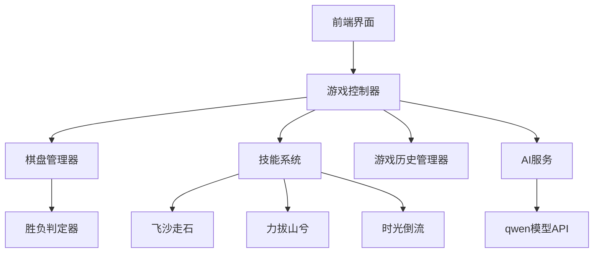

# 技能五子棋游戏设计文档

## 概述

技能五子棋是一个基于Web的单页应用（SPA），采用纯前端架构。应用使用HTML5 Canvas实现棋盘渲染和交互，通过浏览器直接调用qwen模型API实现AI对手功能。游戏支持响应式设计，可在桌面浏览器和移动设备上流畅运行。

**平台选择：Web应用 (HTTP)**
- 跨平台兼容：支持iOS、Android、Windows、macOS
- 即时访问：无需下载安装，通过浏览器直接使用
- 快速迭代：可以随时更新功能和修复问题
- 成本效益：单一代码库支持所有平台

## 架构

### 系统架构图



### 技术栈

- **前端框架**: 纯JavaScript (ES6+) 或 Vue.js/React (可选)
- **界面**: HTML5, CSS3 (支持响应式设计)
- **渲染引擎**: Canvas API (高性能图形渲染)
- **AI集成**: qwen模型 (通过HTTPS API调用)
- **数据存储**: localStorage (游戏历史和设置)
- **网络通信**: Fetch API (AI服务调用)
- **部署**: 静态网站托管 (GitHub Pages, Netlify, 或自建服务器)

## 组件和接口

### 1. 游戏控制器 (GameController)

负责协调各个组件，管理游戏流程。

```javascript
class GameController {
    constructor()
    startNewGame()
    handlePlayerMove(x, y)
    handleSkillUse(skillType)
    switchTurn()
    checkGameEnd()
    resetGame()
}
```

### 2. 棋盘管理器 (BoardManager)

管理棋盘状态和棋子操作。

```javascript
class BoardManager {
    constructor(size = 15)
    placePiece(x, y, player)
    removePiece(x, y)
    getPiece(x, y)
    getEmptyPositions()
    getAllPieces()
    isValidPosition(x, y)
    cloneBoard()
}
```

### 3. 胜负判定器 (WinChecker)

检查游戏胜负条件。

```javascript
class WinChecker {
    checkWin(board, lastMove)
    checkDirection(board, x, y, dx, dy, player)
    isDraw(board)
}
```

### 4. 技能系统 (SkillSystem)

管理三种技能的实现。

```javascript
class SkillSystem {
    constructor(gameController)
    useSkill(skillType, player, params)
    canUseSkill(skillType, player)
    
    // 具体技能实现
    flyingSandStorm(board)      // 飞沙走石
    mountainMover(board, targets) // 力拔山兮  
    timeRewind(gameHistory)     // 时光倒流
}
```

### 5. 游戏历史管理器 (GameHistoryManager)

记录和管理游戏状态历史。

```javascript
class GameHistoryManager {
    constructor()
    saveState(boardState, currentPlayer, skillsUsed)
    rewindSteps(steps)
    getCurrentState()
    canRewind(steps)
    clearHistory()
}
```

### 6. AI服务 (AIService)

与qwen模型交互，提供AI决策。

```javascript
class AIService {
    constructor(apiKey)
    async makeMove(boardState, availableSkills)
    async shouldUseSkill(boardState, availableSkills)
    formatBoardForAI(board)
    parseAIResponse(response)
}
```

### 7. 用户界面 (GameUI)

处理用户交互和视觉反馈。

```javascript
class GameUI {
    constructor(canvasElement)
    drawBoard()
    drawPiece(x, y, player)
    highlightPosition(x, y)
    showSkillButtons(availableSkills)
    showGameResult(winner)
    animateSkillEffect(skillType)
}
```

## 数据模型

### 游戏状态 (GameState)

```javascript
const GameState = {
    board: Array(15).fill().map(() => Array(15).fill(0)), // 0: 空, 1: 玩家, 2: AI
    currentPlayer: 1, // 1: 玩家回合, 2: AI回合
    gameStatus: 'playing', // 'playing', 'ended', 'paused'
    winner: null, // null, 1, 2, 'draw'
    skillsUsed: {
        player: { flyingSand: false, mountainMover: false, timeRewind: false },
        ai: { flyingSand: false, mountainMover: false, timeRewind: false }
    },
    moveCount: 0
}
```

### 技能配置 (SkillConfig)

```javascript
const SkillConfig = {
    flyingSand: {
        name: '飞沙走石',
        description: '随机搅乱5颗棋子位置',
        targetCount: 5,
        usesPerGame: 1
    },
    mountainMover: {
        name: '力拔山兮', 
        description: '移除3颗棋子',
        targetCount: 3,
        usesPerGame: 1,
        requiresSelection: true
    },
    timeRewind: {
        name: '时光倒流',
        description: '回溯3个回合', 
        rewindSteps: 6, // 3回合 = 6步 (玩家+AI各一步)
        usesPerGame: 1
    }
}
```

### AI请求格式

```javascript
const AIRequest = {
    boardState: "15x15数组表示的棋盘状态",
    currentPlayer: 2,
    availableSkills: ["flyingSand", "mountainMover", "timeRewind"],
    gameHistory: "最近几步的历史记录",
    difficulty: "normal"
}
```

## 错误处理

### 1. 网络错误处理

- AI服务调用失败时，提供本地简单AI作为后备
- 实现重试机制，最多重试3次
- 显示用户友好的错误信息

### 2. 游戏状态错误

- 非法落子位置检查
- 技能使用条件验证
- 游戏状态一致性检查

### 3. 用户输入验证

- 坐标范围验证
- 技能选择验证
- 游戏阶段验证

```javascript
class ErrorHandler {
    static handleAIError(error) {
        console.error('AI服务错误:', error);
        // 降级到本地AI
        return LocalAI.makeMove();
    }
    
    static validateMove(x, y, board) {
        if (x < 0 || x >= 15 || y < 0 || y >= 15) {
            throw new Error('坐标超出棋盘范围');
        }
        if (board[x][y] !== 0) {
            throw new Error('该位置已有棋子');
        }
    }
}
```

## 测试策略

### 1. 单元测试

- 棋盘管理器的基本操作
- 胜负判定逻辑
- 技能系统的各项功能
- 游戏历史管理

### 2. 集成测试

- 完整游戏流程测试
- AI服务集成测试
- 技能与游戏状态的交互测试

### 3. 用户界面测试

- 交互响应测试
- 动画效果测试
- 错误状态显示测试

### 4. AI测试

- qwen模型响应格式验证
- AI决策合理性测试
- 网络异常情况测试

### 测试用例示例

```javascript
// 胜负判定测试
describe('WinChecker', () => {
    test('应该正确检测水平五连', () => {
        const board = createTestBoard();
        // 设置水平五连
        for(let i = 0; i < 5; i++) {
            board[7][i] = 1;
        }
        expect(WinChecker.checkWin(board, {x: 7, y: 4})).toBe(1);
    });
});

// 技能系统测试
describe('SkillSystem', () => {
    test('飞沙走石应该重新分布指定数量的棋子', () => {
        const board = createBoardWithPieces(8);
        const originalPositions = getAllPiecePositions(board);
        SkillSystem.flyingSandStorm(board);
        const newPositions = getAllPiecePositions(board);
        
        expect(newPositions.length).toBe(originalPositions.length);
        expect(newPositions).not.toEqual(originalPositions);
    });
});
```

## 性能优化

### 1. 渲染优化

- 使用Canvas离屏渲染减少重绘
- 实现局部更新而非全屏重绘
- 棋子和网格分层渲染

### 2. AI调用优化

- 实现AI响应缓存
- 异步调用避免界面阻塞
- 设置合理的超时时间

### 3. 内存管理

- 及时清理游戏历史记录
- 避免深度克隆大对象
- 使用对象池管理临时对象

## 安全考虑

### 1. API密钥保护

- 将API密钥存储在环境变量中
- 实现密钥轮换机制
- 监控API调用频率

### 2. 输入验证

- 严格验证所有用户输入
- 防止XSS攻击
- 限制API调用频率

### 3. 数据完整性

- 验证AI返回数据格式
- 检查游戏状态一致性
- 防止客户端状态篡改